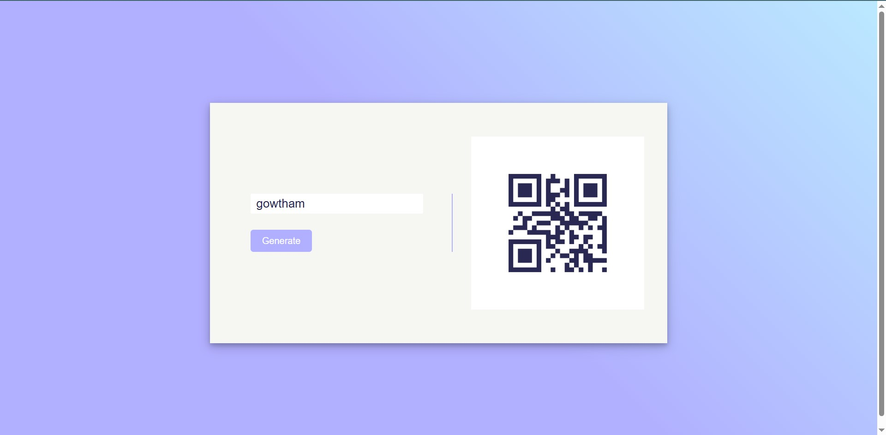

# QR Code Generator

This is a simple QR code generator application built with Node.js and Express. It allows users to input a URL and receive a generated QR code in response.

## Features

- Generate QR codes from URLs
- Simple and clean UI

## Prerequisites

- Node.js installed on your machine

## Installation

1. Clone the repository:

   ```bash
   git clone https://github.com/gowtham2k2/QR-Code-Generator.git
   ```

2. Navigate to the project directory:

   ```bash
   cd QR-Code-Generator
   ```

3. Install the dependencies:
   ```bash
   npm i
   ```

## Usage

1. Start the server:

   ```bash
   node index.js
   ```

2. Open your browser and navigate to `http://localhost:5000`.

3. Enter a URL in the input field and click "Generate" to receive the QR code.

## Output
<div align="center">

</div>
